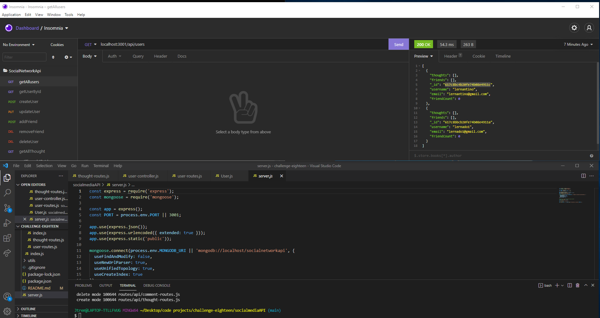

# socicalmediaAPI

  
  ## Description
  Starter Database and API routes for a SocialMedia site build in mongoDB
  
  ## Table of Contents
  * [Installation](#installation)
  * [Usage](#usage)
  * [Contributing](#Contributing)
  * [License](#license)
  * [Tests](#tests)
  * [Questions](#questions)
  
  ## Installation
  To install download or clone the files from the repository and open them in vscode. Then from the root directory run 'npm i' in the command line. 

  ## Usage
  To use this program complete the istallation instructions. Then from the root directory run 'npm start' in the command line to run the program.
  
  ## ScreenShot
  
  

  ## Collaborators
  Joe Tremols
  
  ## License
  Licensed under the [MIT License](https://choosealicense.com/licenses/mit/)
  
  ## Contributing
  Anyone is allowed to contribute to this open source project. See the License section for specifics
  
  ## Questions
  For questions please reachout
  GitHub: [NukaGrizz](https://github.com/NukaGrizz)
  Email: nukagrizz@gmail.com